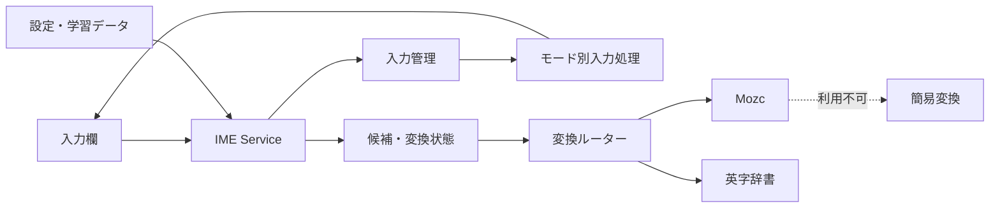

# 2Touch Keyboard

数字キー中心の4 × 5配列で日本語・英字・数字を入力できる、Android向けIMEです。

## 概要

2タッチ入力とケータイ打ちを、現代のAndroid IMEとして実装したプロジェクトです。入力状態の管理、日本語変換、英字予測、入力欄への適応までを一つのアプリにまとめています。

| 項目 | 内容 |
| --- | --- |
| 対象 | Android 7.0（API 24）以上 |
| 入力モード | ひらがな・英字・数字 |
| 日本語変換 | Mozc |
| 英字予測 | 内蔵頻度辞書 |
| 動作方式 | 入力処理はオフライン（更新確認時のみ通信） |

## 主な機能

- 2タッチ入力とケータイ打ちの切り替え
- ひらがな・英字・数字モード
- Mozcによる日本語変換、部分変換、次入力候補
- 前方一致とスペル訂正による英字予測
- 使用履歴に基づく候補の並べ替え
- 濁点・半濁点・小書きかな、大文字・小文字の切り替え
- 入力欄に応じた初期モードとEnter動作の変更
- 記号入力、カーソル移動、削除キーの長押し
- 設定画面と入力確認画面

## 設計と工夫



- **入力処理の分離** — ひらがな・英字・数字と、2タッチ・ケータイ打ちの組み合わせを個別の`InputProcessor`として実装。
- **状態に応じた表示** — 2タッチの1打目、変換中、入力モードに合わせてキー表示を更新。
- **非同期変換** — 入力の変化に追従して変換処理をキャンセルし、古い候補が表示されることを防止。
- **部分変換** — 変換範囲と候補選択を`ConversionSession`で独立管理。
- **変換エンジンの分離** — 日本語はMozc、英字は内蔵辞書へ振り分け。Mozcが使えない環境では簡易変換へ切り替え。
- **入力欄への適応** — `EditorInfo`からパスワード、数値、電話番号、メール、URLを判定し、入力方法を調整。
- **入力データは端末内で完結** — 設定と学習データをアプリ内部に保存。通信はGitHub Releasesの更新確認と、ユーザーが選択したAPKの取得だけに使用。

## 技術構成

| 分類 | 技術 |
| --- | --- |
| 言語 | Kotlin 2.0.21、Java 17 |
| Android | compileSdk 35、targetSdk 35、minSdk 24 |
| IME | `InputMethodService`、XML Views |
| 設定画面 | Jetpack Compose、Material 3 |
| 状態・設定 | Coroutines、Flow、DataStore Preferences |
| 日本語変換 | Mozc、JNI、Protocol Buffers Lite |
| 英字予測 | prefix trie、Damerau–Levenshtein距離 |
| ビルド | Gradle 9.3.0、Android Gradle Plugin 8.7.3 |

アプリ本体と変換エンジンは、`app`と`mozc-engine`の2モジュールに分離しています。英字予測は約1.1万語の頻度辞書を内蔵し、最大20件の候補を生成します。

## テストとCI

JVM単体テストとRobolectricテストで、次の処理を検証しています。

- 2タッチ入力のキー割り当て
- かな修飾と英字切り替え
- 入力欄の判定とEnter動作
- 変換範囲、候補選択、次入力候補
- 英字予測とスペル訂正
- 候補履歴の保存とランキング

GitHub Actionsでは、Mozcネイティブ成果物とAndroid APKを個別にビルドします。APKビルド時は既存のMozc成果物を再利用し、存在しない場合のみ再生成します。タグをpushした場合は、署名済みAPKと更新メタデータをGitHub Releaseへ公開します。

## GitHub Releasesからのアプリ更新

設定画面を開くと、通常UIの表示とは独立したcoroutineで次の固定URLを確認します。

```text
https://github.com/<owner>/<repository>/releases/latest/download/latest.json
```

`owner/repository`は[`gradle.properties`](gradle.properties)の`UPDATE_REPOSITORY`で一元管理します。取得失敗、タイムアウト、HTTPエラー、不正JSON、未対応schemaでは更新UIを表示せず、キーボードと設定画面は通常どおり利用できます。

新しい`versionCode`が見つかり、ユーザーが「更新する」を選んだ場合だけAPKをアプリのcache領域へダウンロードします。APKのSHA-256、保存場所、APK内の`applicationId`と`versionCode`を確認した後、`FileProvider`の`content://` URIでAndroid標準のPackage Installerへ渡します。インストールの確定操作は端末上で必要であり、サイレントアップデートは行いません。

### 配布リポジトリの前提

Release Assetは端末から認証なしで取得できる必要があるため、配布先GitHub repositoryはpublicにしてください。Workflowはprivate repositoryでは公開処理を停止します。GitHub TokenやPATをアプリへ埋め込んでprivate Releaseへアクセスする方式には対応しません。

ソースをprivateのまま保つ場合は、次のようにAPK配布専用のpublic repositoryを分け、`UPDATE_REPOSITORY`をそのpublic repositoryへ向けてください。配布用Workflowもpublic側で実行するか、安全な別repositoryへの公開フローを用意する必要があります。

```text
private source repository
+
public distribution repository
```

### Release signingの準備

更新APKは、端末へインストール済みのAPKと同じ`applicationId`および同じ署名鍵を使い、より大きい`versionCode`を持つ必要があります。GitHub repositoryのActions secretsへ次を登録してください。

| Secret | 内容 |
| --- | --- |
| `RELEASE_KEYSTORE_BASE64` | release keystoreファイル全体をBase64化した値 |
| `RELEASE_STORE_PASSWORD` | keystore password |
| `RELEASE_KEY_ALIAS` | signing key alias |
| `RELEASE_KEY_PASSWORD` | key password |

keystoreやpasswordはGitへ追加しないでください。Workflowはkeystoreを一時領域へ復元し、ビルド後に削除します。署名鍵を失うと、その鍵でインストールした既存アプリを今後更新できません。keystoreと認証情報は、GitHub Secretsとは別の安全な場所にも復旧可能な形でバックアップしてください。

過去にdebug署名APKを端末へ入れている場合、別のrelease鍵で署名したAPKをそのまま上書きできません。初回だけ既存アプリをアンインストールして正式なrelease APKを入れ直す必要があり、その際はアプリ内の設定・学習データが削除されます。既に独自のrelease鍵で配布済みの場合は、必ず同じ鍵をSecretsへ登録してください。

ローカルで署名済みrelease APKを生成する場合も、同名の4環境変数を設定します。`RELEASE_STORE_FILE`だけはBase64ではなく、ローカルkeystoreのファイルパスを指定します。環境変数がないローカル`assembleRelease`は未署名APKを生成しますが、GitHub Actionsのrelease処理はSecrets不足または署名検証失敗時に停止し、未署名APKを公開しません。

### バージョン更新とRelease作成

1. [`app/build.gradle.kts`](app/build.gradle.kts)の`versionCode`を以前より大きい整数へ更新し、`versionName`を公開バージョンへ変更します。
2. 変更をcommitし、`versionName`と完全に一致する`v<versionName>`タグを作ります（例: `versionName = "1.6.0"`なら`v1.6.0`）。
3. タグをGitHubへpushします。

```text
git tag v1.6.0
git push origin v1.6.0
```

`.github/workflows/release.yml`は次の順に処理します。

```text
tagとpublic repositoryを検証
  → unit test
  → release APKを既存鍵で署名
  → APK署名を検証
  → SHA-256を計算
  → draft Releaseを作成
  → app-<versionName>.apkをupload
  → latest.jsonを生成・upload
  → 両Assetの存在を確認
  → Releaseを公開してlatestに設定
```

途中で失敗したReleaseはdraftのまま残るため、`/releases/latest`から不完全な更新が見えることはありません。APK名は`app-1.6.0.apk`のようにバージョン固有で、公開済みのAPKを同じURLで上書きしない運用にしてください。

### `latest.json` schema

schema version 1は次の形式です。`publishedAt`は補助情報で、それ以外の5項目は必須です。更新判定には`versionName`ではなく整数の`versionCode`だけを使用します。

```json
{
  "schemaVersion": 1,
  "versionCode": 16,
  "versionName": "1.6.0",
  "apkUrl": "https://github.com/<owner>/<repository>/releases/download/v1.6.0/app-1.6.0.apk",
  "sha256": "<64 hexadecimal characters>",
  "publishedAt": "2026-09-01T00:00:00Z"
}
```

アプリはHTTPS、schema version 1、正の整数`versionCode`、空でない`versionName`、64桁のSHA-256、`UPDATE_REPOSITORY`配下のGitHub Release APK URLだけを受理します。

### 端末への初回インストール

1. public GitHub Releaseから署名済みAPKを端末へダウンロードします。
2. ブラウザまたはファイル管理アプリに対して「この提供元のアプリを許可」を有効にし、APKをインストールします。
3. 以後アプリ内更新を初めて行う際は、2Touch Keyboard自身に対して同じ許可を求めるAndroid設定画面が開きます。
4. 設定から戻ると、ダウンロード済みAPKを再度SHA-256検証してPackage Installerを起動します。

端末設定の画面名はAndroidバージョンや端末メーカーにより異なります。許可を無効にしてもキーボードは利用でき、必要になったときだけ再度更新操作を行えます。

## リポジトリ構成

```text
.
├─ app/                   IME本体、設定画面、英字予測、候補学習
├─ mozc-engine/           Mozcラッパー、JNI、Protocol Buffers定義
├─ scripts/               MozcのAndroid向けビルド
├─ .github/workflows/     Mozc・APKのCI
├─ build.gradle.kts       共通ビルド設定
└─ settings.gradle.kts    モジュール定義
```

主要な責務は次のとおりです。

| コンポーネント | 責務 |
| --- | --- |
| `TwoTouchKeyboardService` | IME UI、キーイベント、候補表示、変換処理 |
| `KeyboardInputCoordinator` | 入力モードと入力方式の管理 |
| `input/` | モード別の入力状態と文字確定 |
| `english/` | 英字辞書、前方一致、スペル訂正 |
| `candidate/` | 候補学習とランキング |
| `mozc-engine` | MozcセッションとJNI連携 |

## 制約

- Mozcネイティブ成果物はリポジトリに含まれず、現在の標準ビルド対象は`arm64-v8a`。
- Mozcを利用できない環境では、限定的な簡易変換を使用。
- UIとIME subtypeは日本語向けのみ。
- 端末上のUIテストは未整備。
- CIが取得するMozcのコミットは未固定。
- プライバシーポリシーは未収録。
- `LICENSE`ファイルは未収録。再配布時はMozcと辞書を含むライセンス確認が必要。
