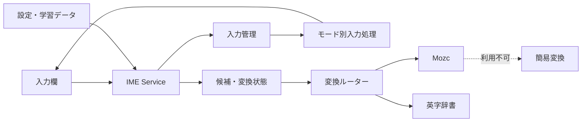

# 2Touch Keyboard

数字キー中心の4 × 5配列で日本語・英字・数字を入力できる、Android向けIMEです。

## 概要

2タッチ入力とケータイ打ちを、現代のAndroid IMEとして実装したプロジェクトです。入力状態の管理、日本語変換、英字予測、入力欄への適応までを一つのアプリにまとめています。

| 項目 | 内容 |
| --- | --- |
| 対象 | Android 7.0（API 24）以上 |
| 入力モード | ひらがな・英字・数字 |
| 日本語変換 | Mozc |
| 英字予測 | 内蔵頻度辞書 |
| 動作方式 | オフライン |

## 主な機能

- 2タッチ入力とケータイ打ちの切り替え
- ひらがな・英字・数字モード
- Mozcによる日本語変換、部分変換、次入力候補
- 前方一致とスペル訂正による英字予測
- 使用履歴に基づく候補の並べ替え
- 濁点・半濁点・小書きかな、大文字・小文字の切り替え
- 入力欄に応じた初期モードとEnter動作の変更
- 記号入力、カーソル移動、削除キーの長押し
- 設定画面と入力確認画面

## 設計と工夫



- **入力処理の分離** — ひらがな・英字・数字と、2タッチ・ケータイ打ちの組み合わせを個別の`InputProcessor`として実装。
- **状態に応じた表示** — 2タッチの1打目、変換中、入力モードに合わせてキー表示を更新。
- **非同期変換** — 入力の変化に追従して変換処理をキャンセルし、古い候補が表示されることを防止。
- **部分変換** — 変換範囲と候補選択を`ConversionSession`で独立管理。
- **変換エンジンの分離** — 日本語はMozc、英字は内蔵辞書へ振り分け。Mozcが使えない環境では簡易変換へ切り替え。
- **入力欄への適応** — `EditorInfo`からパスワード、数値、電話番号、メール、URLを判定し、入力方法を調整。
- **端末内で完結** — 実行時の通信権限を持たず、設定と学習データをアプリ内部に保存。

## 技術構成

| 分類 | 技術 |
| --- | --- |
| 言語 | Kotlin 2.0.21、Java 17 |
| Android | compileSdk 35、targetSdk 35、minSdk 24 |
| IME | `InputMethodService`、XML Views |
| 設定画面 | Jetpack Compose、Material 3 |
| 状態・設定 | Coroutines、Flow、DataStore Preferences |
| 日本語変換 | Mozc、JNI、Protocol Buffers Lite |
| 英字予測 | prefix trie、Damerau–Levenshtein距離 |
| ビルド | Gradle 9.3.0、Android Gradle Plugin 8.7.3 |

アプリ本体と変換エンジンは、`app`と`mozc-engine`の2モジュールに分離しています。英字予測は約1.1万語の頻度辞書を内蔵し、最大20件の候補を生成します。

## テストとCI

JVM単体テストとRobolectricテストで、次の処理を検証しています。

- 2タッチ入力のキー割り当て
- かな修飾と英字切り替え
- 入力欄の判定とEnter動作
- 変換範囲、候補選択、次入力候補
- 英字予測とスペル訂正
- 候補履歴の保存とランキング

GitHub Actionsでは、Mozcネイティブ成果物とAndroid APKを個別にビルドします。APKビルド時は既存のMozc成果物を再利用し、存在しない場合のみ再生成します。

## リポジトリ構成

```text
.
├─ app/                   IME本体、設定画面、英字予測、候補学習
├─ mozc-engine/           Mozcラッパー、JNI、Protocol Buffers定義
├─ scripts/               MozcのAndroid向けビルド
├─ .github/workflows/     Mozc・APKのCI
├─ build.gradle.kts       共通ビルド設定
└─ settings.gradle.kts    モジュール定義
```

主要な責務は次のとおりです。

| コンポーネント | 責務 |
| --- | --- |
| `TwoTouchKeyboardService` | IME UI、キーイベント、候補表示、変換処理 |
| `KeyboardInputCoordinator` | 入力モードと入力方式の管理 |
| `input/` | モード別の入力状態と文字確定 |
| `english/` | 英字辞書、前方一致、スペル訂正 |
| `candidate/` | 候補学習とランキング |
| `mozc-engine` | MozcセッションとJNI連携 |

## 制約

- Mozcネイティブ成果物はリポジトリに含まれず、現在の標準ビルド対象は`arm64-v8a`。
- Mozcを利用できない環境では、限定的な簡易変換を使用。
- UIとIME subtypeは日本語向けのみ。
- 端末上のUIテストは未整備。
- CIが取得するMozcのコミットは未固定。
- リリース署名、配布設定、プライバシーポリシーは未収録。
- `LICENSE`ファイルは未収録。再配布時はMozcと辞書を含むライセンス確認が必要。
